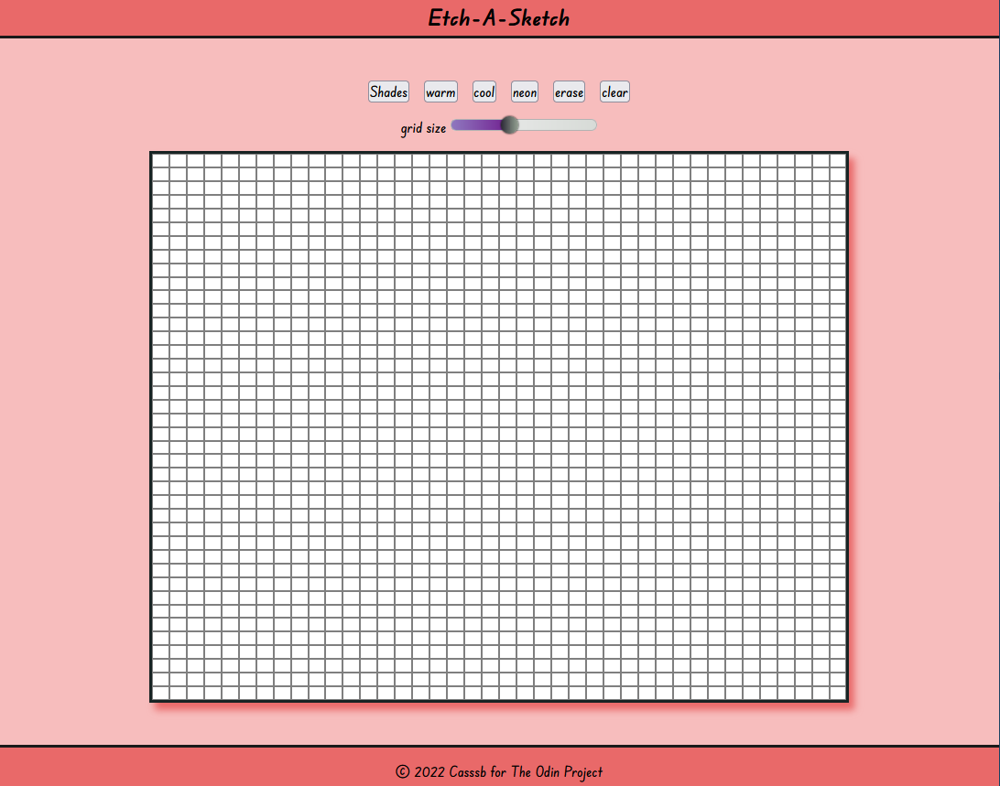

# Etch-A-Sketch

My second project via The Odin Project curriculum using vanilla JS, HTML & CSS.

[Check it out here!](https://casssb.github.io/etch-a-sketch/) :point_left:

##Thoughts

My main focuses here were trying to keep using as much vanilla CSS as possible and make everything as responsive as possbile without using media queries. (I've been learning Tailwind & Bootstrap recently but wanted to stick to using vanilla flexbox & grid as I get the feeling being good with these should help me even more with the CSS Libraries)

I feel like this project has helped me a lot with getting used to DOM manipulation and using event listeners properly. I encountered an interesting bug where it turned out I had assigned too many event listeners to the same nodes and my colour selectors were not behaving properly. I took an extensive detour on StackOverflow and Reddit and I think this has been a major lesson for me in sticking to functional programming as much as possible.

If anyone happens to read this and is trying to make this game I'd recommend trying to contain as much logic as possible within reusable functions and then call these from your event listeners rather than attaching logic independently to each event listener. 
